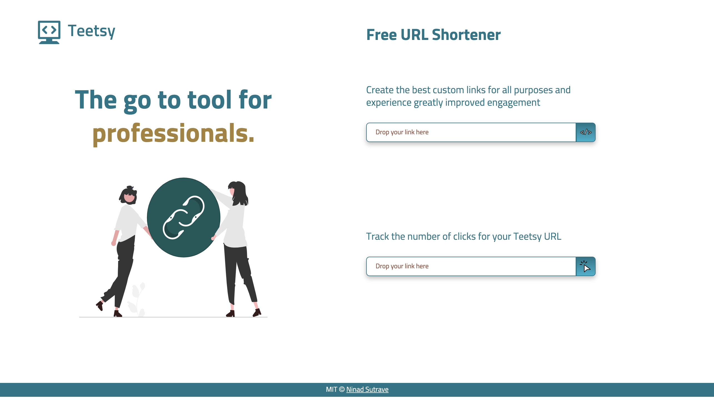
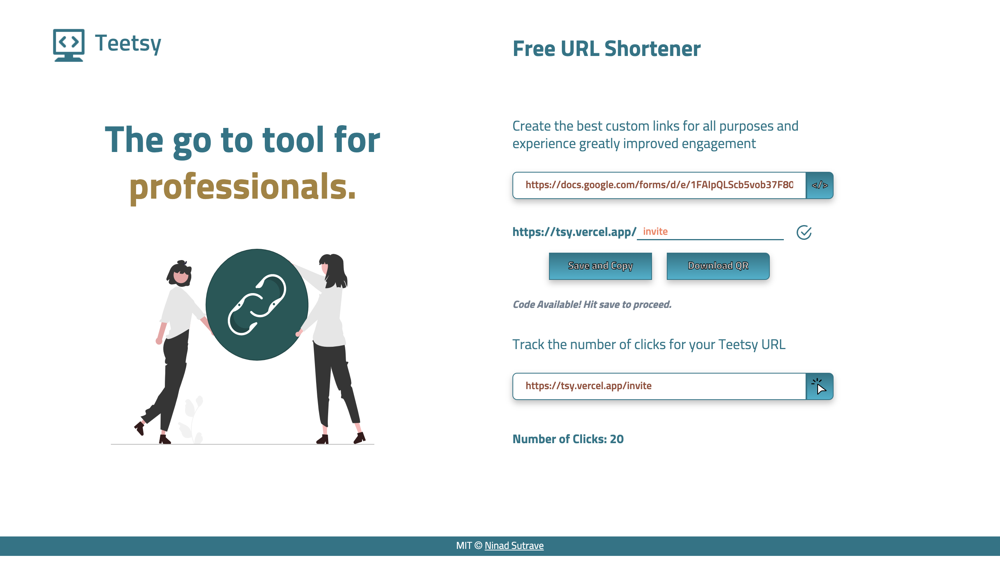

# Teetsy - URL Shortener

## Description

A free and extremely handy tool to shorten the URL of your marketing website, project, portfolio, etc and share links in a much more professional way. Additionally, you can generate a QR code for your URL and can also sufficiently track the number of viewers attracted by Teetsy.

## Why should you use Teetsy?

✓ Create a custom link best suited for your needs

✓ Conveniently share links via messages, tweets, social media, etc

✓ Stronger and improved engagement

✓ Professional appearance

✓ Track number of clicks made

✓ Generate QR code for sharing via posters

## Possible Additions

- Line chart visualising the audience's response over time

## Preview

![My project] (src/assets/qr.png)

## Try it out?

https://teetsy.netlify.app

[View on Dribbble](https://dribbble.com/shots/20646112-Teetsy-URL-Shortening-Website)

## License

MIT © [Ninad Sutrave](https://ninadsutrave.in)
